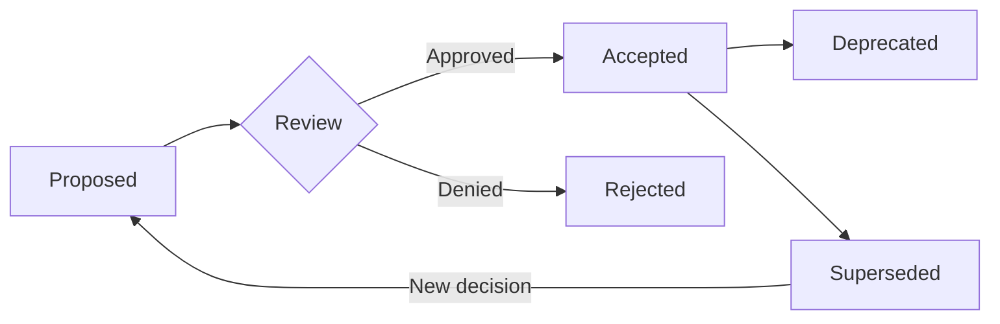

# Architecture Decision Log

> **ADL - Centralized log of all architecture decisions**

## Overview

This document tracks all Architecture Decisions (ADs) and Architecture Decision Records (ADRs) for the **{Project Name}** project.

## Decision Log

| ID | Title | Status | Date | Deciders | Impact |
|----|-------|--------|------|----------|--------|
| [AD-001](./ad-001.md) | {Title} | Accepted | {YYYY-MM-DD} | {names} | High |
| [ADR-001](./adr-001.md) | {Title} | Accepted | {YYYY-MM-DD} | {names} | Medium |
| | | | | | |

## Status Definitions

| Status | Meaning |
|--------|---------|
| **Proposed** | Decision is under discussion, not yet finalized |
| **Accepted** | Decision has been agreed upon and is in effect |
| **Rejected** | Decision was considered but not adopted |
| **Deprecated** | Decision is no longer relevant (technology/context changed) |
| **Superseded** | Decision has been replaced by a newer decision |

## Impact Levels

| Level | Definition | Examples |
|-------|-----------|----------|
| **Critical** | Affects entire system architecture | Database engine, cloud provider |
| **High** | Affects multiple components | API protocol, auth strategy |
| **Medium** | Affects one component | Caching layer, logging framework |
| **Low** | Affects implementation details | Library choice, config format |

## Statistics

| Metric | Count |
|--------|-------|
| Total decisions | |
| Accepted | |
| Rejected | |
| Deprecated | |
| Superseded | |

## Categories

### Infrastructure
<!-- Decisions about hosting, cloud, networking -->

| ID | Title | Status |
|----|-------|--------|
| | | |

### Data
<!-- Decisions about databases, storage, data flow -->

| ID | Title | Status |
|----|-------|--------|
| | | |

### Security
<!-- Decisions about authentication, authorization, encryption -->

| ID | Title | Status |
|----|-------|--------|
| | | |

### Integration
<!-- Decisions about APIs, messaging, third-party services -->

| ID | Title | Status |
|----|-------|--------|
| | | |

### Development
<!-- Decisions about languages, frameworks, tooling -->

| ID | Title | Status |
|----|-------|--------|
| | | |

## Process

### When to Create an AD/ADR

- Choosing a technology (database, framework, language)
- Defining an API contract or protocol
- Establishing a pattern (error handling, logging, auth)
- Making a significant trade-off (performance vs simplicity)
- Any decision that would be costly to reverse

### Lifecycle

### Review Process

1. Author creates AD/ADR from template
2. Submit for review (PR or meeting)
3. Deciders discuss and vote
4. Update status and log
5. Communicate decision to team
