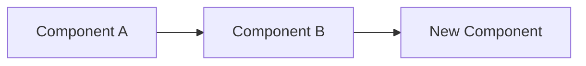

# ADR-{NUMBER}: {Title}

> **Architecture Decision Record** — Based on [Michael Nygard's template](https://cognitect.com/blog/2011/11/15/documenting-architecture-decisions)

## Metadata

| Field | Value |
|-------|-------|
| **Author** | {name} |
| **Date** | {YYYY-MM-DD} |
| **Status** | Proposed / Accepted / Deprecated / Superseded by [ADR-{NUMBER}](link) |
| **Deciders** | {list} |
| **Technical Story** | {ticket/issue link} |

## Context

<!-- What is the issue that we're seeing that is motivating this decision or change?
     Include technical and business context. What forces are at play? -->

## Decision Drivers

<!-- What are the key factors influencing this decision? -->

- **{Driver 1}** - {explanation}
- **{Driver 2}** - {explanation}
- **{Driver 3}** - {explanation}

## Considered Options

### Option 1: {Name}

<!-- Description of the option -->

**Pros:**
- 

**Cons:**
- 

### Option 2: {Name}

<!-- Description of the option -->

**Pros:**
- 

**Cons:**
- 

### Option 3: {Name}

<!-- Description of the option -->

**Pros:**
- 

**Cons:**
- 

## Decision Outcome

**Chosen option: "{Option Name}"**, because {justification}.

### Positive Consequences

- 
- 

### Negative Consequences

- 
- 

## Validation

<!-- How will we know if this decision is the right one? -->

| Metric | Target | Measurement |
|--------|--------|-------------|
| | | |

## Technical Details

### Architecture Impact

<!-- How does this decision affect the system architecture? -->

### Migration Plan

<!-- If this changes existing architecture, how do we get from here to there? -->

1. 
2. 
3. 

### Rollback Strategy

<!-- How do we revert if this doesn't work out? -->

## Links

<!-- References, research, benchmarks, RFCs -->

- 
- 

## Changelog

| Date | Change | Author |
|------|--------|--------|
| {YYYY-MM-DD} | Initial proposal | {name} |
