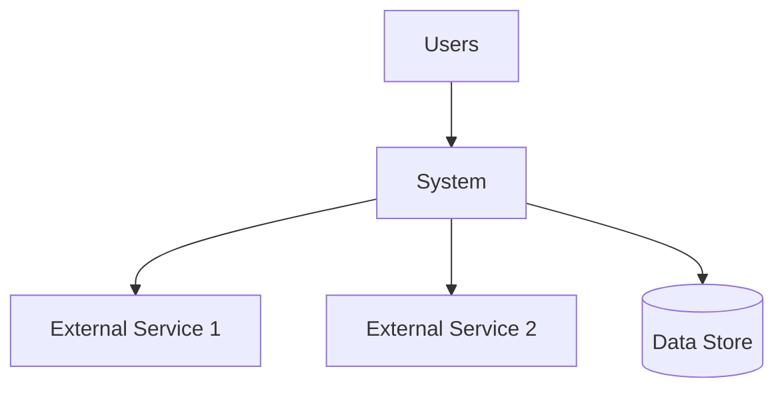

# Architecture Knowledge Management

> **AKM - {Project Name}**

## Metadata

| Field | Value |
|-------|-------|
| **Author** | {name} |
| **Date** | {YYYY-MM-DD} |
| **Last Updated** | {YYYY-MM-DD} |
| **Version** | 1.0 |

## 1. Architecture Overview

### 1.1 System Context

<!-- High-level view of the system and its external interactions -->

### 1.2 Architecture Style

<!-- Monolith, Microservices, Event-Driven, Serverless, etc. -->

| Aspect | Choice | Rationale |
|--------|--------|-----------|
| **Style** | | |
| **Communication** | Sync (REST/gRPC) / Async (Events) | |
| **Data Strategy** | Shared DB / DB per service | |
| **Deployment** | Containers / Serverless / VMs | |

### 1.3 Architecture Principles

| Principle | Description | Implication |
|-----------|-------------|-------------|
| **Loose Coupling** | Services communicate via contracts | API versioning required |
| **Single Responsibility** | Each service owns one domain | Clear boundaries |
| **Fail Fast** | Detect and report errors early | Circuit breakers, health checks |
| **Observable** | All services emit telemetry | Structured logging, metrics, traces |

## 2. Component Catalog

### 2.1 Services

| Service | Owner | Repository | Language | Purpose |
|---------|-------|-----------|----------|---------|
| | | | | |

### 2.2 Data Stores

| Store | Type | Purpose | Owner | SLA |
|-------|------|---------|-------|-----|
| | PostgreSQL / Redis / S3 | | | |

### 2.3 External Dependencies

| Dependency | Type | Purpose | SLA | Fallback |
|-----------|------|---------|-----|----------|
| | API / SaaS / Library | | | |

## 3. Decision History

> See [Architecture Decision Log](./adl.md) for the full list.

### Key Decisions Summary

| ID | Decision | Date | Impact | Status |
|----|----------|------|--------|--------|
| [ADR-001](./adr-001.md) | | | High | Accepted |

### Decision Patterns

<!-- Recurring themes or patterns across decisions -->

| Pattern | Description | Applied In |
|---------|-------------|-----------|
| | | |

## 4. Quality Attributes

### 4.1 Performance

| Metric | Target | Current | Monitoring |
|--------|--------|---------|-----------|
| API p95 latency | < 200ms | | Grafana |
| Throughput | > 1000 req/s | | Prometheus |
| DB query time | < 50ms | | APM |

### 4.2 Reliability

| Metric | Target | Current |
|--------|--------|---------|
| Availability | 99.9% | |
| MTTR | < 30 min | |
| RPO | < 1 hour | |
| RTO | < 4 hours | |

### 4.3 Security

| Aspect | Implementation | Status |
|--------|---------------|--------|
| Authentication | | |
| Authorization | | |
| Encryption at rest | | |
| Encryption in transit | | |
| Secrets management | | |
| Vulnerability scanning | | |

### 4.4 Scalability

| Dimension | Strategy | Trigger |
|-----------|----------|---------|
| Compute | Horizontal auto-scaling | CPU > 70% |
| Database | Read replicas | Read latency > 100ms |
| Cache | Redis cluster | Hit rate < 90% |

## 5. Architecture Risks

| Risk | Probability | Impact | Mitigation | Owner | Status |
|------|------------|--------|------------|-------|--------|
| | High/Med/Low | High/Med/Low | | | Open/Mitigated |

## 6. Technical Debt

| Item | Severity | Effort | Impact | Plan |
|------|----------|--------|--------|------|
| | High/Med/Low | S/M/L/XL | | Planned / Backlog / Deferred |

## 7. Knowledge Sharing

### 7.1 Onboarding Resources

| Resource | Type | Audience | Link |
|----------|------|----------|------|
| Architecture overview | Document | New engineers | |
| Local dev setup | Guide | All engineers | |
| Runbooks | Playbook | On-call engineers | |

### 7.2 Diagrams & Visualizations

<!-- Links to architecture diagrams, C4 models, etc. -->

| Diagram | Tool | Last Updated | Link |
|---------|------|-------------|------|
| System context (C4 L1) | Mermaid | | |
| Container diagram (C4 L2) | Mermaid | | |
| Component diagram (C4 L3) | Mermaid | | |
| Deployment diagram | Mermaid | | |

### 7.3 Communication Channels

| Topic | Channel | Cadence |
|-------|---------|---------|
| Architecture decisions | {channel} | As needed |
| Tech radar updates | {channel} | Quarterly |
| Incident reviews | {channel} | After incidents |

## 8. Governance

### 8.1 Review Process

- **New services**: Architecture review required before development
- **Cross-cutting changes**: ADR required, reviewed by architecture team
- **Dependency additions**: Security review + license check

### 8.2 Standards & Guidelines

| Area | Standard | Enforcement |
|------|----------|-------------|
| API design | OpenAPI 3.x | CI validation |
| Logging | Structured JSON | Linter rules |
| Testing | 70% coverage minimum | CI gate |
| Security | OWASP Top 10 | SAST/DAST in pipeline |

## Changelog

| Date | Change | Author |
|------|--------|--------|
| {YYYY-MM-DD} | Initial creation | {name} |
