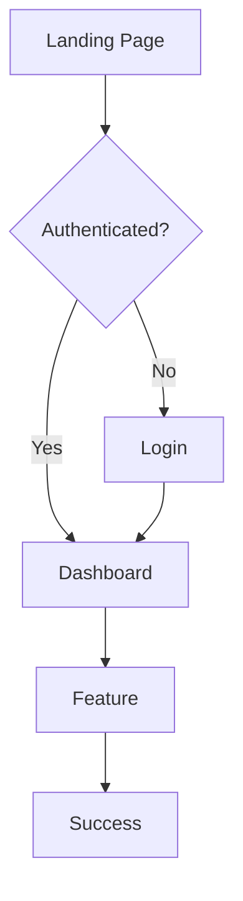

# PRD-{NUMBER}: {Title}

> **Product Requirements Document**

## Metadata

| Field | Value |
|-------|-------|
| **Author** | {name} |
| **Date** | {YYYY-MM-DD} |
| **Status** | Draft / In Review / Approved / Deprecated |
| **Version** | 1.0 |
| **Stakeholders** | {list} |
| **Related TRD** | [TRD-{NUMBER}](link) |

## 1. Executive Summary

<!-- 2-3 sentences: What are we building and why? -->

## 2. Problem Statement

### 2.1 Current State

<!-- What is the current situation? What pain points exist? -->

### 2.2 User Pain Points

| Pain Point | Severity | Frequency | Affected Users |
|-----------|----------|-----------|----------------|
| | High/Medium/Low | Daily/Weekly/Monthly | |

### 2.3 Business Impact

<!-- Quantify the problem: revenue lost, time wasted, churn caused -->

## 3. Goals & Success Metrics

### 3.1 Objectives

| Objective | Key Result | Target | Timeline |
|-----------|-----------|--------|----------|
| | | | |

### 3.2 KPIs

| Metric | Current | Target | Measurement Method |
|--------|---------|--------|--------------------|
| | | | |

### 3.3 Non-Goals

<!-- What are we explicitly NOT trying to solve? -->

- 
- 

## 4. Target Users

### 4.1 User Personas

#### Persona 1: {Name}

| Attribute | Description |
|-----------|-------------|
| **Role** | |
| **Goals** | |
| **Frustrations** | |
| **Technical Level** | Beginner / Intermediate / Expert |

### 4.2 User Segments

| Segment | Size | Priority | Notes |
|---------|------|----------|-------|
| | | P0/P1/P2 | |

## 5. Requirements

### 5.1 Functional Requirements

| ID | Requirement | Priority | User Story |
|----|------------|----------|------------|
| FR-001 | | Must Have | As a {user}, I want {action} so that {benefit} |
| FR-002 | | Should Have | |
| FR-003 | | Could Have | |
| FR-004 | | Won't Have (this release) | |

### 5.2 Non-Functional Requirements

| Category | Requirement | Target |
|----------|------------|--------|
| Performance | Page load time | < 2s |
| Availability | Uptime | 99.9% |
| Accessibility | WCAG compliance | Level AA |
| Localization | Languages supported | {list} |
| Security | Data protection | {standard} |

## 6. User Experience

### 6.1 User Flows

<!-- Describe the main user journey -->

### 6.2 Wireframes / Mockups

<!-- Link to Figma, screenshots, or embed images -->

### 6.3 Edge Cases

| Scenario | Expected Behavior |
|----------|-------------------|
| Empty state (no data) | |
| Error state | |
| Loading state | |
| Offline / slow connection | |

## 7. Technical Considerations

### 7.1 Constraints

<!-- Technical limitations, platform requirements, backward compatibility -->

- 
- 

### 7.2 Dependencies

| Dependency | Owner | Status | Risk |
|-----------|-------|--------|------|
| | | Ready / In Progress / Blocked | |

### 7.3 Data Requirements

<!-- What data is needed? Where does it come from? Privacy implications? -->

## 8. Release Plan

### 8.1 Phases

| Phase | Scope | Target Date | Success Criteria |
|-------|-------|-------------|-----------------|
| Alpha | Core features, internal | | No blockers |
| Beta | Full features, limited users | | NPS > 7 |
| GA | General availability | | KPIs met |

### 8.2 Feature Flags

| Flag | Description | Default | Phase |
|------|-------------|---------|-------|
| | | off | |

## 9. Risks & Mitigations

| Risk | Probability | Impact | Mitigation | Owner |
|------|------------|--------|------------|-------|
| | High/Med/Low | High/Med/Low | | |

## 10. Open Questions

<!-- Decisions that still need to be made -->

- [ ] 
- [ ] 

## 11. Appendix

### 11.1 Research & References

<!-- Links to user research, competitive analysis, market data -->

### 11.2 Glossary

| Term | Definition |
|------|-----------|
| | |

## Approval

| Role | Name | Date | Decision |
|------|------|------|----------|
| Product Manager | | | Approved / Rejected |
| Engineering Lead | | | Approved / Rejected |
| Design Lead | | | Approved / Rejected |
