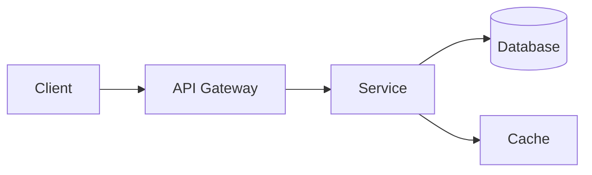

# {Project Name}

<!-- One-line description of what this project does -->

## Features

- **Feature 1** - Brief description
- **Feature 2** - Brief description
- **Feature 3** - Brief description

## Requirements

| Dependency | Version | Required |
|-----------|---------|----------|
| Node.js | >= 20 | Yes |
| PostgreSQL | >= 15 | Yes |
| Redis | >= 7 | No |

## Quick Start

```bash
# Clone the repository
git clone {repo-url}
cd {project-name}

# Install dependencies
{install-command}

# Configure environment
cp .env.example .env
# Edit .env with your values

# Run database migrations
{migration-command}

# Start development server
{dev-command}
```

## Configuration

| Variable | Description | Required | Default |
|----------|-------------|----------|---------|
| `DATABASE_URL` | PostgreSQL connection string | Yes | - |
| `REDIS_URL` | Redis connection string | No | `redis://localhost:6379` |
| `PORT` | Server port | No | `3000` |
| `LOG_LEVEL` | Logging verbosity | No | `info` |
| `NODE_ENV` | Environment | No | `development` |

## Development

### Available Scripts

```bash
{package-manager} run dev       # Start development server
{package-manager} run build     # Build for production
{package-manager} run test      # Run tests
{package-manager} run lint      # Lint code
{package-manager} run format    # Format code
```

### Project Structure

```
{project-name}/
├── src/
│   ├── modules/       # Feature modules
│   ├── common/        # Shared utilities
│   ├── config/        # Configuration
│   └── main.{ext}     # Entry point
├── tests/
│   ├── unit/
│   └── integration/
├── docs/              # Documentation
├── scripts/           # Utility scripts
└── {config-files}
```

### Code Quality

```bash
# Format + Lint + Type Check + Test
{format-command}
{lint-command}
{typecheck-command}
{test-command}
```

### Testing

```bash
# Run all tests
{test-command}

# Run with coverage
{test-coverage-command}

# Run specific test
{test-specific-command}
```

## API Reference

<!-- Link to API docs or brief endpoint summary -->

| Method | Endpoint | Description |
|--------|----------|-------------|
| GET | `/api/v1/health` | Health check |
| GET | `/api/v1/resource` | List resources |
| POST | `/api/v1/resource` | Create resource |

See [API Documentation](./docs/api.md) for full details.

## Deployment

### Production

```bash
# Build
{build-command}

# Start
{start-command}
```

### Docker

```bash
docker build -t {project-name} .
docker run -p 3000:3000 --env-file .env {project-name}
```

## Architecture

<!-- Link to ADRs or brief architecture overview -->



See [Architecture Decisions](./docs/adr/) for detailed records.

## Contributing

See [CONTRIBUTING.md](./CONTRIBUTING.md).

### Commit Convention

This project uses [Conventional Commits](https://www.conventionalcommits.org/):

```
feat(scope): add new feature
fix(scope): resolve bug
docs(scope): update documentation
```

## License

{LICENSE}
