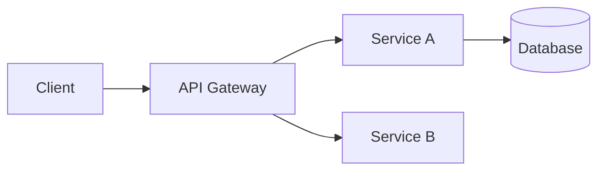
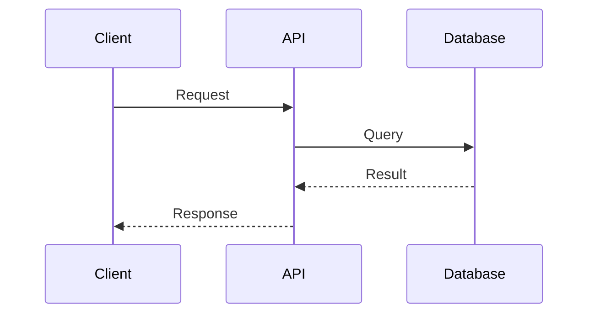
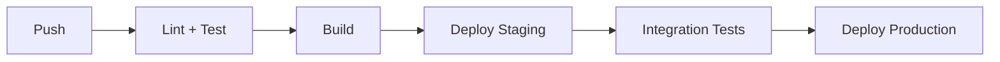

# TRD-{NUMBER}: {Title}

> **Technical Requirements Document**

## Metadata

| Field | Value |
|-------|-------|
| **Author** | {name} |
| **Date** | {YYYY-MM-DD} |
| **Status** | Draft / In Review / Approved / Superseded |
| **Version** | 1.0 |
| **Related PRD** | [PRD-{NUMBER}](link) |
| **Related ADR** | [ADR-{NUMBER}](link) |

## 1. Overview

### 1.1 Purpose

<!-- What technical problem does this document address? -->

### 1.2 Scope

<!-- What is included and excluded from this technical scope? -->

### 1.3 Definitions & Acronyms

| Term | Definition |
|------|-----------|
| | |

## 2. System Architecture

### 2.1 High-Level Architecture

<!-- Use Mermaid diagrams -->



### 2.2 Component Diagram

<!-- Detail the components involved and their interactions -->

| Component | Responsibility | Technology |
|-----------|---------------|------------|
| | | |

### 2.3 Data Flow

<!-- Describe how data moves through the system -->



## 3. Technical Requirements

### 3.1 Functional Requirements

| ID | Requirement | Priority | Acceptance Criteria |
|----|------------|----------|-------------------|
| TR-001 | | Must | |
| TR-002 | | Should | |
| TR-003 | | Could | |

### 3.2 Non-Functional Requirements

#### Performance

| Metric | Target | Measurement |
|--------|--------|-------------|
| Response time (p95) | < 200ms | APM monitoring |
| Throughput | > 1000 req/s | Load testing |
| Availability | 99.9% | Uptime monitoring |

#### Scalability

<!-- How should the system scale? Horizontal/Vertical? Auto-scaling triggers? -->

#### Security

<!-- Authentication, authorization, encryption, data protection requirements -->

- [ ] Authentication: {method}
- [ ] Authorization: {model - RBAC/ABAC}
- [ ] Encryption at rest: {algorithm}
- [ ] Encryption in transit: TLS 1.2+
- [ ] Secrets management: {tool}

#### Observability

- [ ] Structured logging (JSON)
- [ ] Metrics (RED method)
- [ ] Distributed tracing (OpenTelemetry)
- [ ] Alerting with runbooks

## 4. API Design

### 4.1 Endpoints

| Method | Path | Description | Auth |
|--------|------|-------------|------|
| GET | /api/v1/resource | List resources | Bearer |
| POST | /api/v1/resource | Create resource | Bearer |

### 4.2 Data Models

<!-- Define request/response schemas -->

```json
{
  "id": "string (UUID)",
  "name": "string",
  "created_at": "string (ISO 8601)",
  "updated_at": "string (ISO 8601)"
}
```

### 4.3 Error Handling

| Status Code | Meaning | Response Body |
|-------------|---------|---------------|
| 400 | Bad Request | `{ "error": "validation_error", "details": [...] }` |
| 401 | Unauthorized | `{ "error": "unauthorized" }` |
| 404 | Not Found | `{ "error": "not_found" }` |
| 429 | Rate Limited | `{ "error": "rate_limited", "retry_after": 60 }` |
| 500 | Internal Error | `{ "error": "internal_error" }` |

## 5. Data Design

### 5.1 Database Schema

<!-- ERD or table definitions -->

```sql
CREATE TABLE resource (
    id          UUID PRIMARY KEY DEFAULT gen_random_uuid(),
    name        VARCHAR(255) NOT NULL,
    status      VARCHAR(50) NOT NULL DEFAULT 'active',
    created_at  TIMESTAMPTZ NOT NULL DEFAULT NOW(),
    updated_at  TIMESTAMPTZ NOT NULL DEFAULT NOW()
);

CREATE INDEX idx_resource_status ON resource(status);
```

### 5.2 Data Migration Strategy

<!-- How will existing data be migrated? Backward compatibility? -->

### 5.3 Data Retention

| Data Type | Retention Period | Archive Strategy |
|-----------|-----------------|-----------------|
| | | |

## 6. Infrastructure

### 6.1 Deployment Architecture

<!-- Cloud resources, regions, redundancy -->

### 6.2 CI/CD Pipeline



### 6.3 Environment Configuration

| Variable | Description | Required | Default |
|----------|-------------|----------|---------|
| `DATABASE_URL` | PostgreSQL connection | Yes | - |
| `LOG_LEVEL` | Logging verbosity | No | `info` |

## 7. Dependencies

### 7.1 External Services

| Service | Purpose | SLA | Fallback |
|---------|---------|-----|----------|
| | | | |

### 7.2 Libraries / Packages

| Package | Version | Purpose | License |
|---------|---------|---------|---------|
| | | | |

## 8. Testing Strategy

| Level | Coverage Target | Tools | Scope |
|-------|----------------|-------|-------|
| Unit | 70% | pytest/vitest/go test | Business logic |
| Integration | Key paths | testcontainers | API + DB |
| E2E | Critical flows | Playwright | User journeys |
| Load | SLA targets | k6/locust | Performance |

## 9. Rollout Plan

### 9.1 Phases

| Phase | Description | Duration | Success Criteria |
|-------|-------------|----------|-----------------|
| 1 | Feature flag (internal) | 1 week | No errors |
| 2 | Canary (5% traffic) | 3 days | Error rate < 0.1% |
| 3 | General availability | 1 day | All metrics green |

### 9.2 Rollback Plan

<!-- Steps to rollback if issues are detected -->

1. 
2. 
3. 

## 10. Risks & Mitigations

| Risk | Probability | Impact | Mitigation |
|------|------------|--------|------------|
| | High/Medium/Low | High/Medium/Low | |

## 11. Open Questions

<!-- Unresolved technical questions that need answers -->

- [ ] 
- [ ] 

## Approval

| Role | Name | Date | Signature |
|------|------|------|-----------|
| Tech Lead | | | |
| Architect | | | |
| Product Owner | | | |
